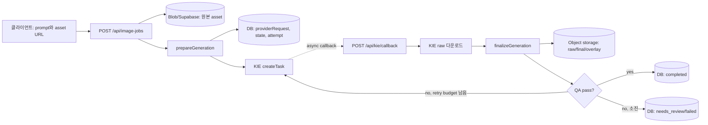

# Aeolo Image Fidelity Adapter

Aeolo 이미지 생성기의 앞·뒤에 붙이는 TypeScript 어댑터다. 이미지 생성 모델을 대체하지 않는다. 생성 전에 입력 순서·역할·도면/누끼 전처리를 결정하고, KIE 결과가 돌아온 뒤 제품 충실도 QA와 결정론적 합성을 수행한다.

현재 세 문제를 다음처럼 분리한다.

| 문제 | `mode` | 핵심 처리 | KIE가 생성하는 것 | 서버가 처리하는 것 |
| --- | --- | --- | --- | --- |
| 1. 제품 variation/참조 권한 혼동 | `generate`, `swap` | 각 이미지의 설명과 역할을 입력 순서대로 prompt에 고정 | 전체 생성/편집 결과 | prompt compile |
| 2. 글자·비율·색 drift | `composite` | 빈 배경만 생성하고 원본 RGBA 누끼를 결정론적으로 합성 | 제품이 없는 background plate | 광원·화각 분석, 균일 scale, 접지 그림자, 합성, ΔE QA |
| 2. 문맥형 접지·그림자 | `outpaint` (선택) | 제품이 놓인 흰 캔버스를 2K outpaint하고 같은 canonical layer를 저장 좌표에 재중첩 | 제품 주변 장면·접지·그림자 | 선배치, exact re-overlay, raw 경계 이동 QA |
| 3. 도면 비율 drift | `dieline` | 도면 전용 입력 slot, 1:1 패딩, pixel geometry contract | 도면 내부를 한 번에 편집한 raw | 패딩, silhouette, overlay, W/H·IoU QA |

라우팅은 명시적이다. 이 패키지 안의 LLM이나 classifier가 mode, 제품 상태, 재질, 도면 section 의미를 추론하지 않는다.

## 먼저 알아둘 결론: Vercel에서 돌아가는가

돌아간다. 2·3번에서 로컬로 필요한 것은 GPU가 아니라 **Node.js Function의 CPU와 메모리**다.

- Nano Banana Pro 추론은 KIE 서버에서 실행된다. Aeolo/Vercel에는 모델용 GPU가 필요 없다.
- `sharp`/libvips와 typed array가 PNG decode, blur, resize, flood-fill, mask, 합성, ΔE를 CPU로 처리한다.
- Node.js runtime을 사용한다. Edge runtime용 코드는 아니다: `export const runtime = 'nodejs'`.
- KIE 완료를 한 Function에서 polling하며 기다리지 않는다. 요청을 생성하고 종료한 뒤 KIE callback에서 후처리한다.
- Vercel Function 요청/응답 body 한도 때문에 원본 이미지를 base64 JSON으로 실어 보내지 않는다. 브라우저/기존 업로드 경로에서 Blob·Supabase Storage 등에 먼저 저장하고 API에는 URL만 보낸다.
- `/tmp`나 process memory는 callback까지 유지되지 않는다. `state`와 바이너리는 DB/object storage에 저장한다.

Vercel 공식 문서 기준으로 Node/Python Functions에는 vCPU와 메모리가 배정되며, Function request/response payload는 4.5 MB 제한이 있다. 자세한 현재 한도는 [Vercel Functions Limits](https://vercel.com/docs/functions/limitations), [Node.js Runtime](https://vercel.com/docs/functions/runtimes/node-js), [Vercel Blob](https://vercel.com/docs/vercel-blob)을 확인한다.

2026-07-21 Mac 로컬 smoke에서 Vitest process 전체 기준:

| 작업 | 대상 | test body 시간 | process max RSS |
| --- | --- | ---: | ---: |
| 도면 prepare + 기존 2K raw QA | 1건 | 약 0.70초 | 약 225 MB |
| 누끼 분석 + 1K background 최종화 | 2건 | 약 1.40초 | 약 365 MB |

Vitest/Node 자체 overhead를 포함한 수치이며 Vercel 성능 보장은 아니다. 그래도 GPU 없이 일반 Function 자원 범위에서 처리할 크기다. 큰 batch는 한 invocation에 묶지 말고 job 단위로 분리한다.

## 전체 데이터 흐름



`providerRequest`와 `state`의 역할이 다르다.

- `providerRequest`: KIE로 보낼 정확한 model/input payload. 실패 시 **같은 값**으로 재시도한다.
- `state`: callback에서 합성·QA를 재현하기 위한 JSON. 메모리 객체가 아니라 DB에 저장한다.
- binary asset: `state`에는 URL만 넣고 실제 PNG는 object storage에 둔다.

## 설치와 public API

pnpm monorepo에서는 이 저장소를 `packages/image-fidelity`로 가져오거나 Git dependency로 연결한다.

```json
{
  "dependencies": {
    "@geo/image-fidelity": "workspace:*"
  }
}
```

```sh
pnpm install
pnpm typecheck
pnpm test
```

호스트가 직접 부르는 함수는 두 개다.

```ts
import {
  prepareGeneration,
  finalizeGeneration,
  type BinaryAssetStore,
} from '@geo/image-fidelity'
```

- `prepareGeneration(input, assetStore)`: KIE 요청, dispatch target, callback state 생성
- `finalizeGeneration({ rawResult, state, assetStore })`: raw 보존, composite/outpaint/dieline 후처리와 QA 생성

패키지는 KIE API, DB, Blob 구현을 소유하지 않는다. Aeolo owner가 기존 endpoint와 job table에 연결할 수 있게 그 경계를 작게 유지했다.

## API가 consume하고 write하는 데이터

권장 외부 API 입력은 URL 기반 JSON이다. 아래 `sourceUrl`은 endpoint에서 fetch하여 `Buffer`로 바꾼 다음 어댑터에 넘긴다.

고객 UI에서 받는 값과 내부 adapter 값은 구분한다. 고객은 prompt와 이미지별 간단한 설명만 작성하면 되고, 아래 `role`은 업로드 slot/mode를 아는 Aeolo 서버가 내부적으로 채우는 권한 계약이다.

### 문제 1: reference role / swap

```json
{
  "mode": "swap",
  "originalPrompt": "사람이 cap을 제거한 open 제품의 노출된 내용물을 피부에 직접 바르는 장면을 만든다.",
  "productStateInstruction": "IMAGE 2의 open body가 최종 제품이다. 제거된 cap과 그 cap에 속한 라벨은 결과에 나타내거나 body로 옮기지 않는다.",
  "references": [
    {
      "id": "scene",
      "kind": "scene",
      "url": "https://storage/.../scene.jpg",
      "description": "Lifestyle scene reference.",
      "role": "Framing, camera, background, subject and lighting only."
    },
    {
      "id": "open-product",
      "kind": "product",
      "url": "https://storage/.../open.png",
      "description": "Canonical open-state product.",
      "role": "Open-state silhouette, proportions, construction and exposed product only."
    }
  ]
}
```

첫 이미지는 scene authority다. 뒤의 제품·detail 이미지는 각 role이 허용한 속성만 담당한다. compiler에는 특정 브랜드, 손, 재질, 제품명이 고정되어 있지 않다.

`swap`에서는 `originalPrompt`와 `productStateInstruction`이 모두 필수다. `originalPrompt`는 실제 결과에 보여야 할 행동을 직접 기술하고, `productStateInstruction`은 open/closed 상태와 부품 관계를 확정한다. 다른 상태의 reference에서 라벨·재질·seam을 가져오더라도 원래 물리 부품에서 다른 부품으로 옮기는 것은 공통 계약이 금지한다. 예를 들어 라벨이 붙은 cap이 결과 상태에서 빠진다면 라벨도 생략하며, 라벨을 body에 옮기지 않는다.

### 문제 2: canonical cutout composite

치수를 아는 lane:

```json
{
  "mode": "composite",
  "originalPrompt": "고객의 원문 prompt",
  "canonicalCutout": {
    "sourceUrl": "https://private-storage/.../canonical-cutout.png",
    "description": "Front-view transparent cutout of a compact packaged product.",
    "role": "LOCAL-ONLY canonical foreground pixels, geometry, color and label. Never send to the generator."
  },
  "size": { "mode": "measured", "physicalHeightCm": 10 },
  "color": { "mode": "strict" }
}
```

치수를 모르는 lane:

```json
{
  "mode": "composite",
  "originalPrompt": "고객의 원문 prompt",
  "canonicalCutout": {
    "sourceUrl": "https://private-storage/.../canonical-cutout.png",
    "description": "Front-view transparent cutout of a compact packaged product.",
    "role": "LOCAL-ONLY canonical foreground pixels, geometry, color and label."
  },
  "size": { "mode": "semantic", "fallbackHeightCm": 10 },
  "color": { "mode": "strict" }
}
```

`semantic`은 description에 적힌 일반 form factor를 정규식 rule table로 해석한다. 브랜드별 치수 DB가 아니다. 모르는 유형은 caller의 fallback, 없으면 10 cm를 사용하고 `confidence: low`로 기록한다.

색감까지 제한적으로 맞추려는 경우에만 `ambient`를 명시한다.

```json
{
  "color": {
    "mode": "ambient",
    "strength": 1.0,
    "maxMeanDeltaE2000": 2.0,
    "maxP95DeltaE2000": 3.5
  }
}
```

`ambient`는 배치 지점 주변의 neutral-like pixel을 샘플링해 bounded linear-RGB gain을 계산한다. 채도가 높은 브랜드 컬러에는 더 약하게 적용하고, 라벨 글자·윤곽·antialias 경계처럼 고주파인 픽셀은 보정 강도를 추가로 낮춘다. `ambient`를 선택하고 strength를 생략하면 `1.0`을 요청하지만, ΔE00 budget을 넘는 plate에서는 이진 탐색으로 실제 적용 강도를 자동으로 낮춘다. 알파·크기·좌표는 바꾸지 않으며, `color.detailProtectedPixelCount`, `color.intendedChangeFromCanonical`, 합성 중 비의도 변경인 `opaqueCore`를 별도로 기록한다.

`strict` 결과에서 제품 색이 누끼와 완전히 같은 것은 누락이 아니라 계약이다. 색감 통일이 필요한 결과만 `ambient`를 선택한다. 두 mode 모두 cast shadow, contact shadow, 초밀착 occlusion core는 배경 뒤쪽 레이어에 생성한다.

중요한 보존 규칙:

- canonical cutout은 KIE `image_input`에 들어가지 않는다. KIE는 빈 배경만 생성한다.
- 제품에는 perspective/mesh warp를 하지 않는다. 허용 변형은 한 축이 아닌 **uniform scale** 하나뿐이다.
- `strict`에서는 foreground WB/curve 변환도 하지 않는다. 배경을 제품의 광원/WB에 맞춰 생성한다.
- `ambient`에서도 RGB만 명시된 ΔE00 budget 안에서 바꾸며 alpha, bbox, W/H는 그대로다.
- procedural cast/contact/초밀착 occlusion-core shadow는 제품 뒤에 그리고 배치 지점의 중성 색을 반영해 tint한다. canonical 또는 ambient-transformed layer를 마지막에 overlay한다.
- 따라서 합성 때문에 생긴 opaque 제품 core의 RGB 차와 ΔE00 목표는 두 mode 모두 정확히 0이다. `ambient`의 의도된 색 변화는 별도 필드다.

자동 perspective/mesh warp는 이 lane에 포함하지 않는다. 3D 제품의 새 시점을 2D homography로 정확히 복원할 수 없고 보간이 라벨 픽셀과 비율을 바꾸기 때문이다. 화각·지지면 QA가 실패하면 `geometry.incompatiblePlateAction = retry_empty_background_plate`를 반환한다. 평면 라벨처럼 homography가 올바른 자산은 destination quad를 받는 별도 비-fidelity mode로 분리해야 한다.

#### 선택형 `outpaint`: 장면이 제품 주위에서 직접 접지·그림자를 생성해야 할 때

`composite`보다 모델 문맥 결합은 좋지만 KIE raw 안의 제품은 재생성될 수 있다. 따라서 raw를 최종 제품으로 쓰지 않고, 요청 전에 저장한 **동일 resized RGBA layer와 동일 정수 좌표**를 callback에서 마지막에 다시 중첩한다.

```json
{
  "mode": "outpaint",
  "originalPrompt": "고객의 장면·분위기·소품 원문 prompt",
  "canonicalCutout": {
    "sourceUrl": "https://private-storage/.../canonical-cutout.png",
    "description": "Front-view compact packaged product in its canonical closed state.",
    "role": "Locked canonical foreground geometry, color, label, highlight, edge and silhouette pixels."
  },
  "size": { "mode": "measured", "physicalHeightCm": 10 },
  "resolution": "2K",
  "placement": {
    "heightFraction": 0.38,
    "centerXFraction": 0.52,
    "contactYFraction": 0.71,
    "maxRawBoundaryOffsetPx": 4
  },
  "color": {
    "mode": "ambient",
    "strength": 1,
    "maxMeanDeltaE2000": 2,
    "maxP95DeltaE2000": 3.5
  }
}
```

- 기본값은 테스트한 `2K`, 높이 `38%`, 가로 중심 `52%`, 접지선 `71%`다. 모두 제품별 하드코딩이 아니라 request field다.
- `prepareGeneration`은 uniform scale과 translation만으로 흰 16:9 캔버스를 만들고, 그 캔버스 URL 하나만 KIE `image_input[0]`에 넣는다.
- `state`에는 KIE 입력 캔버스 URL, exact canonical layer URL, `x/y/width/height/contactY`가 남는다. callback에서 모델 결과를 다시 탐지해 위치를 정하지 않는다.
- `finalizeGeneration`은 provider canvas 크기와 raw silhouette edge 이동을 검사한 뒤 canonical layer를 저장 좌표에 재중첩한다. 최종 opaque 제품 픽셀은 `changed=0`, silhouette IoU는 `1`이어야 한다.
- raw가 움직였거나 canvas 크기가 바뀌면 `outpaintAcceptance.retryRecommended=true`다. 반투명 1–2px 경계는 provider raw가 아래에 남을 수 있어 halo warning을 별도로 기록한다.
- `color` 생략 또는 `strict`는 canonical RGB를 그대로 보존한다. `ambient`는 raw 제품 영역을 제외한 접지부 주변색만 샘플링해 composite와 같은 bounded RGB transform을 적용한다.
- `ambient`도 alpha·좌표·W/H는 바꾸지 않고, 라벨·윤곽 고주파는 약하게 보정하며 평균/P95 ΔE00 예산을 넘으면 strength를 자동 감쇠한다. `outpaintReport.color`에 실제 적용 강도와 수치가 남는다.
- KIE가 만든 접지·cast shadow는 canonical 밖의 raw 장면에 남고, strict 또는 ambient canonical layer가 마지막에 올라간다. 이는 새 조명을 물리적으로 렌더링하는 relighting이 아니라 제한된 WB/노출 보정이다.

### 문제 3: dieline

도면은 normal `references`가 아니라 전용 `dielineImage` 자리에 넣는다.

```json
{
  "mode": "dieline",
  "originalPrompt": "고객 원문. section/재질 의미 매핑도 여기에 포함한다.",
  "dielineImage": {
    "sourceUrl": "https://storage/.../drawing.png",
    "description": "Front orthographic engineering drawing with a closed exterior silhouette."
  },
  "supportReferences": [
    {
      "id": "studio-depth",
      "kind": "support",
      "url": "https://storage/.../photo.png",
      "description": "Front studio photo of another product.",
      "role": "Depth, scale and studio lighting only. Do not copy geometry, text, material or color."
    }
  ],
  "finalSize": 2048
}
```

전처리 코드는 내부선에 `cap`, `body`, `material boundary` 같은 뜻을 부여하지 않는다. section 수가 1개든 3개든 기계적 처리는 같다. 의미는 오직 고객 `originalPrompt`에서 온다.

## endpoint 연결 예시

실제 framework에 독립적인 전체 예시는 [`examples/aeolo-server-flow.ts`](examples/aeolo-server-flow.ts)에 있다. 핵심은 다음과 같다.

```ts
const source = Buffer.from(await (await fetch(input.dielineImage.sourceUrl)).arrayBuffer())
const prepared = await prepareGeneration({
  ...input,
  dielineImage: { ...input.dielineImage, source },
}, assetStore)

await jobs.insert({
  id: jobId,
  providerRequest: prepared.providerRequest,
  fidelityState: prepared.state,
  attempt: 1,
})

const { taskId } = await kie.createTask(prepared.providerRequest, callbackUrl)
await jobs.attachTask(jobId, taskId)
```

callback에서는 KIE result URL을 읽어 byte를 얻고:

```ts
const finalized = await finalizeGeneration({
  rawResult,
  state: job.fidelityState,
  assetStore,
})

const retry = finalized.qaAcceptance?.retryRecommended === true
  || finalized.compositeAcceptance?.retryRecommended === true
  || finalized.outpaintAcceptance?.retryRecommended === true
```

- `dieline` FAIL: 같은 drawing URL, prompt, reference 순서와 `providerRequest`로 재생성한다.
- `composite` FAIL: canonical 제품은 건드리지 않고 같은 empty-plate `providerRequest`로 새 배경 후보를 만든다.
- `outpaint` FAIL: 같은 저장 캔버스/좌표 계약으로 새 KIE 후보를 만들고, 성공 raw에만 exact re-overlay를 적용한다.
- 무한 재시도하지 않는다. 예: 총 3회 후 `needs_review`.
- KIE task 생성과 callback은 idempotency key/job attempt로 중복 처리한다.

KIE 호출 형식은 현재 어댑터 output과 그대로 맞는다.

```http
POST https://api.kie.ai/api/v1/jobs/createTask
Authorization: Bearer $KIE_API_KEY
Content-Type: application/json

{ "model": "nano-banana-pro", "input": { ... } }
```

API key는 Vercel server environment에만 둔다. 브라우저, DB JSON, 로그, 저장소에 넣지 않는다.

## object storage 구현

callback까지 필요한 최소 interface다.

```ts
interface BinaryAssetStore {
  put(input: {
    purpose:
      | 'composite-canonical-cutout'
      | 'outpaint-model-input'
      | 'outpaint-canonical-layer'
      | 'dieline-model-input'
      | 'dieline-qa-mask'
    contentType: 'image/png'
    data: Buffer
  }): Promise<{ url: string }>

  get(url: string): Promise<Buffer>
}
```

권한 권장값:

| `purpose` | KIE가 읽는가 | 권장 저장 방식 |
| --- | --- | --- |
| `dieline-model-input` | 예 | 짧은 만료 signed URL 또는 unguessable public URL |
| `dieline-qa-mask` | 아니오 | private |
| `composite-canonical-cutout` | 아니오 | private |
| `outpaint-model-input` | 예 | KIE callback 완료까지 읽을 수 있는 signed/public URL |
| `outpaint-canonical-layer` | 아니오 | private; callback exact re-overlay까지 보존 |

Vercel Blob을 쓰면 큰 client 업로드는 [client uploads](https://vercel.com/docs/vercel-blob/client-upload) 경로를 권장한다. 기존 Supabase Storage adapter가 있다면 새 저장소를 만들 필요 없이 이 interface만 구현하면 된다.

## 문제 2가 사용하는 기술과 연산

1. **Alpha bbox**: 투명도 `> 0`인 canonical 제품 경계를 찾는다.
2. **광원 분석**: 흰 라벨 글자를 배제하기 위해 material-colored opaque pixel의 luma를 Gaussian low-pass한다. 밝기 무게중심과 alpha 기하중심의 차이로 대략적 방향을 얻고, interior gradient로 soft/hard를 추정한다.
3. **화이트밸런스 힌트**: neutral-like opaque pixel의 median RGB에서 warm/neutral/cool만 분류한다. 제품 색을 바꾸는 값이 아니라 background prompt용 값이다.
4. **화각 호환성**: alpha 좌우 mirror IoU, centerline roll, 상/중/하 폭 변화, 좌우 edge parallelism으로 frontal/angled를 판정한다. 누끼 한 장만으로 focal length mm를 안다고 주장하지 않는다.
5. **빈 배경 생성**: 제품 설명·role, 광원, 정면 화각, 예상 크기, 지지면 위치를 prompt에 넣되 제품 픽셀은 보내지 않는다. composite lane은 focus-stacked/infinite-depth-of-field와 no-bokeh를 hard contract로 넣으며, 가까운 seamless backdrop을 우선해 모델의 자동 원거리 defocus를 생성 단계에서 피한다. 제품이나 배경을 사후 sharpen/deblur하지 않는다.
6. **지지면 검출**: 배경 중앙부를 48/34/24/16% 폭으로 반복 분석한다. 각 폭의 row median RGB gradient에서 rear/front 수평 경계 쌍을 골라 얕은 top surface와 contact row를 찾는다. 윗면 앞선 뒤에 두꺼운 fascia 하단이 하나 더 보이는 3-edge slab은 상단 두 선을 선택한다. 따라서 전체 폭 선반뿐 아니라 중앙의 작은 포디움과 두꺼운 선반도 처리한다.
7. **배경 광원 gate**: 전체 장면에서는 방향·WB·노출을 읽고, shadow hardness는 제품이 놓일 빈 지지면의 국소 ROI에서 다시 측정한다. 전체 장면의 수건·고글·가구 경계를 hard shadow로 오인하지 않기 위함이다.
8. **색감 mode**: `strict`는 canonical RGB를 보존한다. `ambient`는 배치 지점의 neutral sample에 맞춘 작은 linear-RGB gain만 적용하며 CIEDE2000 budget으로 상한을 걸고 라벨·윤곽의 고주파 픽셀을 보호한다.
9. **결정론적 합성**: uniform scale, 배경의 광질·국소 색에 맞춘 broad cast shadow·contact shadow·초밀착 occlusion core, foreground layer 순서로 합성한다.
10. **QA와 재시도 판정**: W/H 오차, 의도/비의도 ΔE00, alpha 보존, 접지 위치, support depth, paired horizontal-cue tilt를 검사하고 `compositeAcceptance.accepted/retryRecommended/reasons`를 반환한다.

선택형 `outpaint`는 5–10번의 empty-plate 검출/프로시저럴 shadow 대신, 선배치한 제품 주위를 KIE가 직접 확장한다. 이후 raw 경계 registration을 검사하고 exact canonical layer를 마지막에 재중첩한다. 두 lane은 서로 대체 구현이 아니라, 빈 plate의 결정론을 우선할지 장면 문맥 결합을 우선할지에 따른 명시적 선택이다.

자동 지지면 검출의 의도된 범위는 제품이 똑바로 설 수 있고 배치 지점 주변의 국소 접선이 수평에 가까운 평면이다. 전체 폭으로 긴 받침만 요구하지는 않지만, 심하게 기울어진 암석·곡면·제품보다 좁은 불안정한 면을 자동 해석하는 segmentation 기능은 아니다. 그런 plate는 QA에서 거절하고 같은 empty-plate 요청으로 새 후보를 생성한다.

SAM, OpenCV, torch, rembg, 학습형 harmonizer, GPU는 사용하지 않는다. Sharp/libvips와 작은 TypeScript pixel loop만 사용한다. `strict`는 foreground를 다시 생성하거나 색변환하지 않아 라벨·비율·고유색 drift를 구조적으로 차단한다.

## 문제 3이 사용하는 기술과 연산

1. 도면을 흰 배경 RGB로 flatten한다.
2. 원본을 늘이지 않고 native 정사각형에 흰색 padding한다.
3. 2048 canvas 안에 들어가는 최대 **정수 배수**로만 키운 뒤 다시 padding한다.
4. Pillow 실험과 pixel-compatible한 Lanczos resampler를 TypeScript로 구현해 당시 입력 픽셀을 재현한다.
5. 바깥 흰 영역을 flood-fill하고 닫힌 내부를 QA silhouette mask로 만든다. 이 mask는 KIE에 보내지 않는다.
6. bbox pixel 좌표와 W/H를 generic inpaint prompt에 기록한다.
7. KIE raw는 resize, warp, clipping, 합성 없이 보존한다.
8. 별도 QA 복사본에 실제 도면의 흰색만 투명화해 겹치고 W/H, IoU, coverage, outside drift를 계산한다.

기본 acceptance는 `abs(W/H error) <= 1%` 그리고 `silhouette IoU >= 0.99`다. 모델 생성은 확률적이므로 prompt가 같아도 단발 결과는 달라진다. 이 threshold가 retry/fallback의 기준이다.

## 검증 결과

공개 검증 절차는 [`docs/verification.ko.md`](docs/verification.ko.md)에, 문제 2의 CPU-only 기술 판단과 출처는 [`docs/composite-research.ko.md`](docs/composite-research.ko.md)에 기록했다. 공개본에는 고객 이미지, 고객 prompt, 브랜드 분석값, provider task ID를 포함하지 않는다.

- 문제 1: reference 순서, role 권한, 제품 상태 계약, component-attribute 귀속을 unit test로 검증한다.
- 문제 2: uniform scale, exact canonical overlay, alpha·W/H·RGB·ΔE00 보존, support/camera gate를 deterministic test로 검증한다.
- 문제 2 `outpaint`: 저장한 좌표의 exact re-overlay와 raw boundary drift 판정을 검증한다.
- 문제 3: 1:1 padding, Pillow-compatible Lanczos, silhouette mask, overlay, W/H·IoU gate를 snapshot/unit test로 검증한다.

“코드가 provider raw를 판별·후처리하는가”와 “생성 모델이 매번 성공하는가”는 별개다. 전자는 test suite로 검증하며, 후자는 보장하지 않으므로 production에서 QA gate와 retry/parallel-candidate budget을 둔다.

## Python 원본 실험

[`reference/python`](reference/python)에 당시 실험에 사용한 Python/Pillow/numpy 구현을 같이 보존했다.

- 이것은 provenance와 비교용이다. production 기본 구현은 `src/` TypeScript다.
- 공개 저장소에는 credential을 넣지 않았다. Python KIE 실행도 `KIE_API_KEY` environment를 읽는다.
- 원래 workspace 상대경로를 전제로 한 CLI이므로, 그대로 배포하기보다 연산을 비교하거나 독립 batch를 재현할 때 사용한다.
- Python runtime으로 배포할 수도 있지만 Aeolo가 TypeScript/Vercel이라면 별도 Python endpoint를 만드는 이점이 없다.

## 파일 구조

| 파일 | 책임 |
| --- | --- |
| `src/workflow.ts` | 5개 mode adapter, provider request, callback state |
| `src/reference-roles.ts` | 문제 1 reference 순서·권한과 swap contract |
| `src/composite.ts` | 문제 2 광원/화각/크기/접지/합성/ΔE QA |
| `src/outpaint.ts` | 문제 2 선택형 2K 선배치/outpaint/exact re-overlay/경계 QA |
| `src/dieline.ts` | 문제 3 패딩/prompt/overlay/W·H/IoU QA |
| `src/pillow-lanczos.ts` | Pillow-compatible 8-bit RGB Lanczos |
| `examples/aeolo-server-flow.ts` | DB·KIE callback을 포함한 호스트 연결 예시 |
| `reference/python/` | 당시 Python 실험 원본의 credential-redacted copy |
| `test/` | deterministic unit/snapshot test |

## owner 연결 체크리스트

- 기존 request schema에 `mode`와 전용 `canonicalCutout`/`dielineImage` slot 추가
- 이미지 본문 대신 storage URL consume
- Node runtime에서 URL을 `Buffer`로 fetch하여 `prepareGeneration` 호출
- `providerRequest`, `state`, `taskId`, `attempt`를 job row에 저장
- 기존 visual-generation/swap dispatcher에 `dispatchTarget` 연결
- callback에서 raw를 다운로드하고 `finalizeGeneration` 호출
- raw, final, overlay, QA JSON을 서로 다른 필드/asset으로 저장
- composite/outpaint/dieline QA FAIL 시 같은 `providerRequest`를 제한 횟수 재시도
- API key와 private asset URL을 client/log에 노출하지 않기
- production traffic 전 1K/2K Function duration·memory 관측값 확인

새 public endpoint가 반드시 필요한 것은 아니다. 기존 image job create/callback endpoint에 mode 분기와 두 adapter 호출을 넣어도 된다. 코드가 너무 작은 조각으로 끝나지 않도록 데이터 계약, 상태 persistence, 재시도 판단까지 예제에 포함했다.
